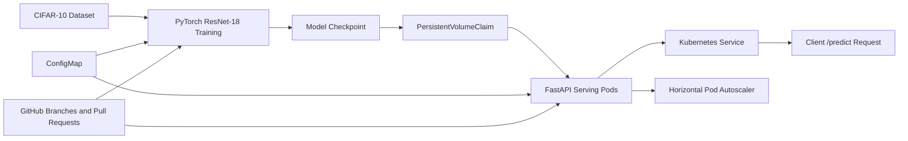

# MLOps PyTorch Pipeline

End-to-end CIFAR-10 image-classification pipeline using PyTorch, Docker, Kubernetes, persistent storage, FastAPI model serving, and Horizontal Pod Autoscaling.

## Project Overview

This project implements a reproducible machine-learning workflow for training and serving a CIFAR-10 image-classification model. The training pipeline uses a ResNet-18 model, YAML-based configuration, checkpointing, JSON-formatted metrics, and early stopping. Docker packages the training and serving applications, while Kubernetes manages persistent storage, training-job configuration, model serving, health checks, and autoscaling.

## Architecture



## Repository Structure

```text
mlops-pytorch-pipeline/
├── .github/
│   └── workflows/
│       └── ci.yml
├── checkpoints/
├── configs/
│   └── training_config.yaml
├── data/
├── docker/
│   ├── Dockerfile.train
│   └── Dockerfile.serve
├── docs/
│   └── architecture.md
├── k8s/
│   ├── namespace.yaml
│   ├── configmap.yaml
│   ├── pvc.yaml
│   ├── training-job.yaml
│   ├── serving-deployment.yaml
│   ├── serving-service.yaml
│   └── hpa.yaml
├── requirements/
│   ├── train.txt
│   └── serve.txt
├── src/
│   ├── __init__.py
│   ├── dataset.py
│   ├── model.py
│   ├── serve.py
│   └── train.py
├── tests/
│   └── test_model.py
├── .dockerignore
├── .gitignore
└── README.md
```

## Technologies

* Python 3.11 or later
* PyTorch 2.11.0
* TorchVision 0.26.0
* CIFAR-10
* Docker Desktop
* Kubernetes
* Minikube
* kubectl
* FastAPI
* Uvicorn
* Git and GitHub
* GitHub Actions

## Prerequisites

Install the following tools before running the project:

* Python
* Git
* Docker Desktop
* kubectl
* Minikube
* A GitHub account

For GPU training, an NVIDIA GPU with a compatible driver and the NVIDIA Container Toolkit support provided by Docker Desktop are required. GPU support is optional for the Kubernetes portion of this project.

Verify the tools in PowerShell:

```powershell
python --version
git --version
docker --version
docker compose version
kubectl version --client
minikube version
```

## Local Python Environment

Run the following commands from the repository root.

```powershell
python -m venv .venv
Set-ExecutionPolicy -Scope Process -ExecutionPolicy Bypass
.\.venv\Scripts\Activate.ps1
```

Install the training dependencies:

```powershell
python -m pip install --upgrade pip
python -m pip install -r requirements\train.txt
```

Install the serving dependencies when running the API locally:

```powershell
python -m pip install -r requirements\serve.txt
```

## Configuration

Training parameters are defined in `configs/training_config.yaml`:

```yaml
seed: 42

model:
  architecture: resnet18
  num_classes: 10

training:
  epochs: 10
  batch_size: 64
  learning_rate: 0.001
  early_stopping_patience: 3

data:
  dataset: cifar10
  data_dir: ./data
  num_workers: 0

output:
  checkpoint_dir: ./checkpoints
  model_name: classifier_v1.pt
```

The configuration controls the model architecture, dataset, training duration, batch size, learning rate, early-stopping patience, data directory, and checkpoint location.

## Local GPU Training

Run training locally with:

```powershell
python src\train.py
```

The first run downloads CIFAR-10 into the `data` directory. Training prints JSON records for the training start, each completed epoch, checkpoint creation, early stopping, and training completion.

Example training events:

```json
{"event": "training_started", "device": "cuda", "gpu": "NVIDIA GeForce RTX 5070 Laptop GPU"}
{"event": "epoch_completed", "epoch": 10, "train_accuracy": 0.7786, "val_accuracy": 0.772}
{"event": "training_completed", "best_val_loss": 0.6594}
```

The best model checkpoint is saved to:

```text
checkpoints/classifier_v1.pt
```

Verify the checkpoint:

```powershell
Test-Path .\checkpoints\classifier_v1.pt
```

## Docker Training

Build the training image:

```powershell
docker build -f .\docker\Dockerfile.train -t mlops-pytorch-train:latest .
```

Verify GPU access inside the image:

```powershell
docker run --rm --gpus all mlops-pytorch-train:latest python -c "import torch; print('PyTorch:', torch.__version__); print('CUDA available:', torch.cuda.is_available()); print('GPU:', torch.cuda.get_device_name(0) if torch.cuda.is_available() else 'Not detected')"
```

Run the complete training container:

```powershell
docker run --rm --gpus all `
  -v "${PWD}\data:/app/data" `
  -v "${PWD}\checkpoints:/app/checkpoints" `
  mlops-pytorch-train:latest
```

The volume mounts preserve the downloaded dataset and checkpoint on the host machine.

## Docker Model Serving

Build the serving image:

```powershell
docker build -f .\docker\Dockerfile.serve -t mlops-pytorch-serve:latest .
```

The serving container expects the model checkpoint at:

```text
/app/checkpoints/classifier_v1.pt
```

Run the API locally with the checkpoint mounted into the container:

```powershell
docker run --rm -p 8080:8080 `
  -v "${PWD}\checkpoints:/app/checkpoints:ro" `
  -e MODEL_CHECKPOINT=/app/checkpoints/classifier_v1.pt `
  mlops-pytorch-serve:latest
```

## Kubernetes Setup

Start Minikube with Docker as the driver:

```powershell
minikube start --driver=docker --cpus=2 --memory=4096
```

Verify the cluster:

```powershell
kubectl get nodes
```

Load the local images into Minikube:

```powershell
minikube image load mlops-pytorch-train:latest
minikube image load mlops-pytorch-serve:latest
```

Create the namespace, ConfigMap, and persistent volume claim:

```powershell
kubectl apply -f k8s\namespace.yaml
kubectl apply -f k8s\configmap.yaml
kubectl apply -f k8s\pvc.yaml
```

Verify the resources:

```powershell
kubectl get namespace ml-training
kubectl get configmap,pvc -n ml-training
```

The PVC should show status `Bound`.

## Kubernetes Training Job

The training Job is configured with:

* Namespace: `ml-training`
* Image: `mlops-pytorch-train:latest`
* Ten training epochs
* Batch size 64
* Two requested CPU cores
* Four GiB requested memory
* ConfigMap-mounted training configuration
* Persistent storage mounted at `/app/data`
* Persistent storage mounted at `/app/checkpoints`

Submit the Job:

```powershell
kubectl apply -f k8s\training-job.yaml
kubectl get job,pod -n ml-training
```

View the logs:

```powershell
kubectl logs -f -n ml-training -l app=cifar10-training
```

Wait for completion:

```powershell
kubectl wait --for=condition=complete job/cifar10-training -n ml-training --timeout=30m
```

The Kubernetes Job may take considerably longer on a local CPU-only Minikube cluster. The local Minikube node used for this project did not advertise an `nvidia.com/gpu` resource. Therefore, the full 10-epoch training result was completed and validated using Docker with the NVIDIA GPU, while Kubernetes configuration and workload execution were validated separately.

## Copying the Validated Checkpoint to the PVC

If the Kubernetes CPU training Job is not practical to complete locally, the validated checkpoint can be copied into the PVC for serving validation. Create a temporary loader Pod:

```powershell
@"
apiVersion: v1
kind: Pod
metadata:
  name: checkpoint-loader
  namespace: ml-training
spec:
  restartPolicy: Never
  containers:
    - name: loader
      image: busybox:1.36
      command: ["sh", "-c", "mkdir -p /mnt/checkpoints /mnt/data && sleep 3600"]
      volumeMounts:
        - name: storage
          mountPath: /mnt
  volumes:
    - name: storage
      persistentVolumeClaim:
        claimName: training-storage
"@ | kubectl apply -f -
```

Wait for the loader Pod and copy the checkpoint:

```powershell
kubectl wait --for=condition=Ready pod/checkpoint-loader -n ml-training --timeout=60s
kubectl cp .\checkpoints\classifier_v1.pt ml-training/checkpoint-loader:/mnt/checkpoints/classifier_v1.pt
kubectl exec -n ml-training checkpoint-loader -- ls -lh /mnt/checkpoints
kubectl delete pod checkpoint-loader -n ml-training
```

The checkpoint should be visible as:

```text
/mnt/checkpoints/classifier_v1.pt
```

## Kubernetes Model Serving

The serving Deployment uses two replicas and mounts the checkpoint from the PVC in read-only mode. Apply the Deployment, Service, and HPA:

```powershell
kubectl apply -f k8s\serving-deployment.yaml
kubectl apply -f k8s\serving-service.yaml
kubectl apply -f k8s\hpa.yaml
```

Check the rollout:

```powershell
kubectl rollout status deployment/cifar10-serving -n ml-training --timeout=180s
kubectl get deployment,pods,service,hpa -n ml-training
```

Expected deployment state:

```text
cifar10-serving   2/2
```

The Service exposes port 80 and forwards requests to container port 8080. The readiness and liveness probes call `/health`.

## Health Check

Forward the Kubernetes Service to the local machine:

```powershell
kubectl port-forward service/cifar10-serving 8080:80 -n ml-training
```

Keep the port-forward command running and open another terminal. Test the health endpoint:

```powershell
Invoke-RestMethod http://localhost:8080/health
```

A healthy response includes:

```json
{
  "status": "ok",
  "model": "classifier_v1",
  "device": "cpu"
}
```

## Prediction Check

Create a CIFAR-10 test image:

```powershell
python -c "from torchvision.datasets import CIFAR10; from PIL import Image; d=CIFAR10(root='data', train=False, download=False); Image.fromarray(d.data[0]).save('test-image.png')"
```

Send the image to the API:

```powershell
curl.exe -X POST -F "image=@test-image.png" http://localhost:8080/predict
```

Example response:

```json
{
  "class_id": 3,
  "class_name": "cat",
  "confidence": 0.84,
  "model": "classifier_v1"
}
```

The predicted class and confidence can vary because they depend on the trained checkpoint and input image.

Remove the temporary test image after validation:

```powershell
Remove-Item -Force .\test-image.png
```

## Horizontal Pod Autoscaler

Enable the Minikube metrics server:

```powershell
minikube addons enable metrics-server
```

Check HPA status:

```powershell
kubectl get hpa -n ml-training
kubectl top pods -n ml-training
```

The HPA is configured with:

* Minimum replicas: 2
* Maximum replicas: 4
* CPU target utilization: 60 percent

## Testing and Validation

Run Python syntax checks:

```powershell
python -m py_compile src\model.py src\dataset.py src\train.py src\serve.py
```

Run the model tests:

```powershell
pytest -q
```

Check Kubernetes resources:

```powershell
kubectl get all -n ml-training
kubectl get pvc -n ml-training
kubectl get hpa -n ml-training
```

Check serving logs:

```powershell
kubectl logs -n ml-training -l app=cifar10-serving --tail=50
```

## Results

### Local and Docker GPU Training

* Model: ResNet-18
* Dataset: CIFAR-10
* Epochs: 10
* Device: NVIDIA GeForce RTX 5070 Laptop GPU
* Final training accuracy: 77.86 percent in the Docker run
* Final validation accuracy: 77.20 percent in the Docker run
* Best validation loss: 0.6594
* Checkpoint: `checkpoints/classifier_v1.pt`

### Kubernetes Serving

* Namespace: `ml-training`
* Serving replicas: 2
* Service port: 80
* Container port: 8080
* HPA range: 2 to 4 replicas
* Observed HPA CPU utilization: approximately 2 percent
* Health endpoint: `/health`
* Prediction endpoint: `/predict`

## Git Workflow

The project uses a protected-branch style workflow:

```text
main
└── develop
    ├── feature/model-training
    ├── feature/docker-training
    ├── feature/kubernetes-training
    ├── feature/model-serving
    └── feature/documentation
```

Feature work is developed on separate branches, pushed to GitHub, and merged into `develop` through pull requests. The final `develop` branch is merged into `main` through a pull request.

Typical commands:

```powershell
git switch develop
git pull origin develop
git switch -c feature/my-change

git add .
git commit -m "feat: describe the change"
git push -u origin feature/my-change
```

On GitHub, create a pull request with:

```text
Base branch: develop
Compare branch: feature/my-change
```

## Limitations

* The local Minikube cluster did not expose an `nvidia.com/gpu` resource, so Kubernetes training ran on CPU.
* Full 10-epoch GPU training was completed and validated using Docker.
* Kubernetes was used to validate the Job configuration, ConfigMap, PVC, model-serving Deployment, Service, health probes, and HPA.
* The serving containers use the CPU PyTorch image because Kubernetes GPU scheduling was not available in the local Minikube cluster.

## Architecture Documentation

The detailed architecture diagram is available in [docs/architecture.md](docs/architecture.md).


